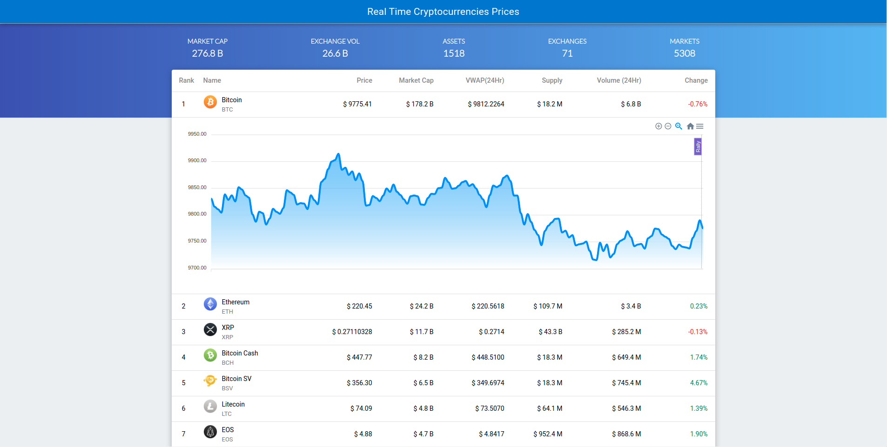

<p>
  <h1>Real Time Crypto Prices & Charts</h1>
  <p>
    An application based on Quasar Framework which shows realtime crypto prices.
    <br />
    <br />
    <br />
    
    <br />
    <br />
  </p>
</p>

[](https://IronLad85.github.io/realtime-crypto-prices)

<br />

## Install the dependencies
```bash
npm install
```

### Start the app in development mode (hot-code reloading, error reporting, etc.)
```bash
quasar dev
```
### Build the app for production
```bash
quasar build
```